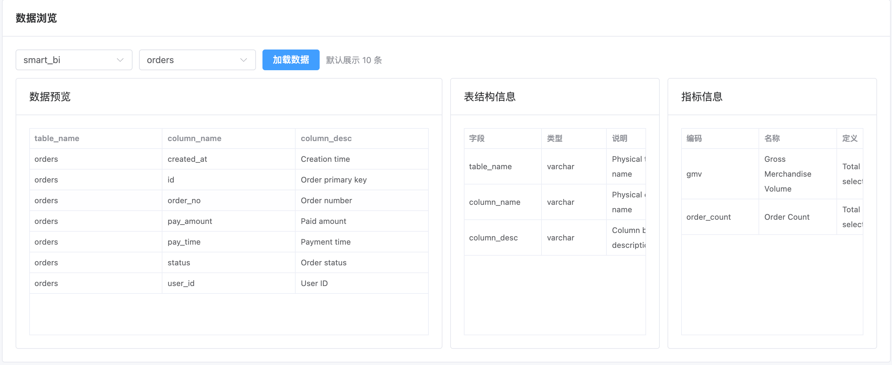
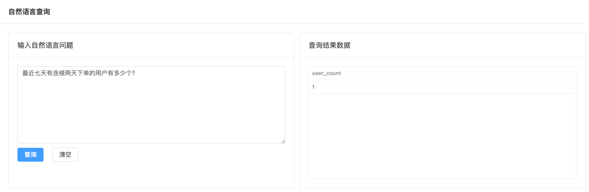

# Smart BI Assistant

前后端分离项目根目录。

## 目录说明

- `backend/`：Spring Boot 后端（已完成 NL2SQL MVP、双模型容灾、SQL 安全校验）
- `frontend/`：Vue3 前端（后续开发）
- `docs/`：架构说明、联调文档、设计文档

## 当前状态

- 已完成后端基础工程和 NL2SQL 核心流程打通
- 已支持 MiniMax 优先、DeepSeek 兜底的模型调用策略
- 已支持 MySQL 本地初始化脚本与示例数据
- 前端目录已预留，待后续初始化

## 快速开始

- 后端启动说明见：`backend/README.md`
- 前端启动：
  - `cd frontend`
  - `npm install`
  - `npm run dev`
  - 默认通过 Vite 代理访问后端：`/api -> http://localhost:8080`

## 效果展示

### 数据语言

### 查询 SQL 以及查询逻辑

### 自然语言查询以及结果

